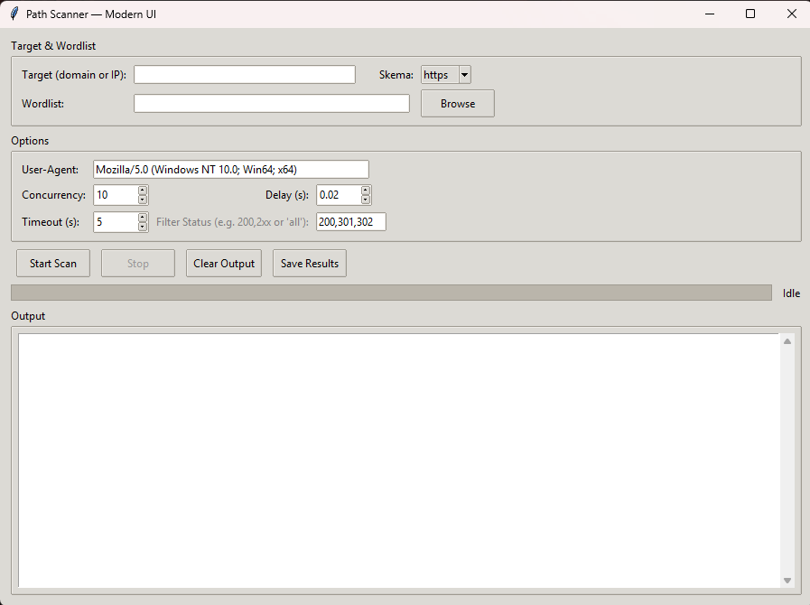

<h1 align="center">🔍 Path Scanner GUI</h1>

<p align="center">
  
  
  
  
  
</p>

---

## 🧩 Overview
**Path Scanner GUI** adalah tool berbasis Python dengan antarmuka grafis (GUI) yang berfungsi untuk melakukan pemindaian path secara cepat dan efisien.  
Didesain untuk **developer, pentester, dan sysadmin** yang membutuhkan hasil analisis struktur direktori dan file secara visual dan interaktif.

### ✨ Fitur Utama
- Antarmuka GUI sederhana dan responsif  
- Scan direktori dan subdirektori dengan cepat  
- Filter hasil berdasarkan ekstensi atau nama file  
- Support untuk Windows, Linux, dan macOS  
- Log hasil scan otomatis  

---

## 🖼️ Screenshots
<p align="center">
  
</p>

---

## ⚙️ Installation

```bash
# Clone repository
git clone https://github.com/yourusername/Path-Scanner-GUI.git
cd Path-Scanner-GUI

# Jalankan aplikasi
python path-gui.py
